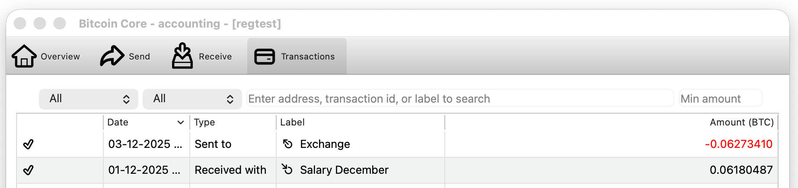
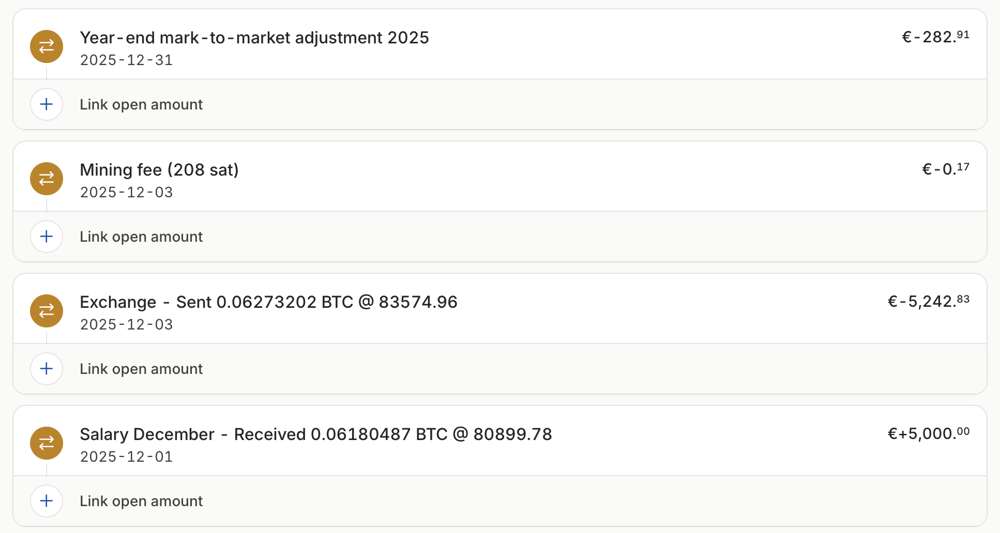

# btc-accounting

Rust CLI for Bitcoin accounting tasks.

Current commands: `received-value`, `cache-rates`, `export`, `reconstruct`.

## Available commands

### `received-value`

Find the fiat price when the transaction you received got confirmed. It uses the volume-weighted average price on Kraken for the smallest candle available.

The command works as follows:

1. Takes a Bitcoin address.
2. Queries the `mempool.space` API (or a self-hosted replacement) to find the unique _receive_ transaction for that address.
3. Fetches Kraken price data.
4. Uses the smallest Kraken `OHLC` candle interval that can still cover the transaction confirmation time (override with `--candle <minutes>`).
5. Estimates the value of the received BTC in the quote currency of the chosen Kraken pair.

### `cache-rates`

Populate `.cache/rates.json` for one UTC calendar year of Bitcoin rates.

```bash
cargo run -- cache-rates 2024
cargo run -- cache-rates --vwap 2024
cargo run -- cache-rates --vwap --candle 60 2024
```

The command works as follows:

1. Without `--vwap`, fetches the daily (`1440`) Kraken `OHLC` data that is still available through the public API.
2. Detects which closed UTC candles in the requested year are still missing because they are older than Kraken's 720-candle retention window.
3. Backfills those missing candles into `.cache/rates.json` from one of Kraken's downloadable archives:
   the default OHLCVT archive, or the larger time-and-sales archive when `--vwap` is set.

By default, the cache keys are written as normal `1440`-minute entries. With `--vwap`, the command writes entries at `DEFAULT_CANDLE_MINUTES` if configured, or `1440` otherwise; `--candle <minutes>` overrides that in the normal way.

Trade-off:

- Recent days use Kraken's daily `OHLC` API `vwap`, just like the normal live lookup path.
- Without `--vwap`, older archive-backed days use the daily `(open + close) / 2` midpoint derived from Kraken's OHLCVT CSV, because the downloadable OHLCVT archive does not include `vwap`.
- Without `--vwap`, the command only fills missing cache entries for that year and interval; it does not overwrite existing entries with midpoint-derived values.
- With `--vwap`, the command computes exact Kraken VWAP candles at the chosen interval from the downloadable time-and-sales trade archive (`timestamp,price,volume`) and overwrites any existing cache entries for that year and interval.
- With `--vwap`, the command first checks whether the public API still covers part of the requested year at the chosen interval. If quarterly trade archives are available for the rest, it keeps the API slice and downloads only the missing quarters. If the complete trade archive is inevitable anyway, it skips the API and computes the whole year from the archive.
- With `--vwap`, the command tries quarterly trade archives first and falls back to Kraken's complete trade archive automatically if that year's quarterly trade ZIPs are not published.
- Downloaded Kraken archive ZIPs are kept under `.cache/kraken/` and reused across later runs; the command does not keep expanded CSV files on disk.
- `--vwap` is substantially heavier because Kraken's trade archives are much larger than the OHLCVT archives, especially when the complete trade archive ZIP is needed instead of quarterly updates.

For years whose quarterly trade ZIPs are not published, `cache-rates --vwap`
falls back to Kraken's complete trade archive, which requires a ~12G download.
But it does mean VWAP values can be constructed as far back as late 2013.

### `export`

<p>
  <br />
  <sub>Bitcoin Core wallet</sub>
</p>

<p>
  <br />
  <sub>Fiat accounting software</sub>
</p>

Export wallet transactions to CAMT.053 accounting format.

Reads transactions from a [Bitcoin Core](https://bitcoincore.org/en/download/) wallet via JSON-RPC or a [phoenixd](https://phoenix.acinq.co/server) CSV export, converts them to a CAMT.053 XML bank statement. Supports fiat conversion at spot rates, optional FIFO realized gain/loss entries, and mark-to-market year-end reconciliation. If the output file already exists, new transactions are appended (deduplication by entry reference).

```bash
# Bitcoin Core wallet (via JSON-RPC)
cargo run -- export --country NL --wallet mywallet --datadir ~/.bitcoin --output statement.xml

# Phoenixd Lightning wallet (via CSV export)
phoenix-cli exportcsv
cargo run -- export --country FR --phoenixd-csv payments.csv --nodeid 03864e... --output lightning.xml
```

The `--nodeid` is only needed on first run; it is cached in `.cache/phoenixd_node.txt`.
Get it with `phoenix-cli getinfo`.

Key options:
- `--country <CC>` — IBAN country code, e.g. NL (required; env: `IBAN_COUNTRY`)
- `--wallet <name>` — Bitcoin Core wallet name (auto-detected if only one wallet is loaded)
- `--fiat-mode` — convert BTC amounts to fiat at Kraken spot rates
- `--fifo` — enable FIFO lot tracking for realized gains/losses in fiat mode
- `--mark-to-market` — add year-end reconciliation entries (default on in fiat mode, can be combined with `--fifo`)
- `--output <file>` — output file path (appends if file exists)
- `--start-date <YYYY-MM-DD>` — only include transactions from this date
- `--candle <minutes>` — Kraken candle interval (`DEFAULT_CANDLE_MINUTES` or `1440` by default)
- `--fee-threshold-cents <n>` — fold fees below this threshold into the parent entry description (default: 1)
- `--phoenixd-csv <file>` — use a phoenixd CSV export as the transaction source (instead of Bitcoin Core RPC)
- `--nodeid <id>` — phoenixd node public key (cached after first use; find it with `phoenix-cli getinfo`)
- `--datadir <path>` — Bitcoin Core data directory (for cookie auth)
- `--chain <name>` — chain: main, testnet3, testnet4, signet, regtest (default: main)

The IBAN in the output is generated deterministically from the wallet's master fingerprint (on-chain) or the node public key (Lightning). The bank code is `XBTC` on mainnet, `TBTC` on test networks, and `LNBT` for Lightning. The BIC in the XML servicer field is derived from the IBAN (e.g. `XBTCNL2A` or `LNBTFR2A`).

The generated XML conforms to the CAMT.053.001.02 schema (ISO 20022) and validates against the official XSD. Each entry contains enough information to map back to the original Bitcoin transaction (block hash, txid, vout).

When `--fifo` is enabled together with `--fiat-mode`, the export adds virtual `:fifo:` entries that book realized gains or losses based on FIFO lot tracking.

See [src/export/README.md](src/export/README.md) for details on the CAMT.053 format, transaction mapping, and accounting software compatibility.

### Privacy: watch-only descriptors and transaction IDs

The CAMT.053 output includes watch-only descriptors as XML comments, only for addresses that actually received coins. They allow reconstructing the exact set of receive addresses in a watch-only wallet (see `reconstruct` command below).

Each entry also contains a blockchain reference (`blockhash:txid:vout` in `<AddtlNtryInf>`).

The example `tests/fixtures/salary_2025_camt053.xml` can be used to test your accounting software without real data. It simulates a 12-month salary scenario with deterministic wallets, fiat conversion, and mark-to-market entries.

### `reconstruct`

Verify a CAMT.053 export by reconstructing the wallet from its embedded watch-only descriptors. Creates a new watch-only wallet in Bitcoin Core, imports the descriptors found in the XML comments, and checks that every transaction in the export is accounted for.

```bash
# Verify against a running node (auto-creates watch-only wallet)
cargo run -- reconstruct --input statement.xml --chain regtest

# Use an existing wallet instead of creating a new one
cargo run -- reconstruct --input statement.xml --wallet my_watch_only
```

Key options:
- `--input <file>` — CAMT.053 XML file to verify (required)
- `--wallet <name>` — use an existing wallet (default: creates `reconstruct-<IBAN>`)
- `--chain <name>` — chain: main, testnet3, testnet4, signet, regtest (default: main)
- `--datadir <path>` — Bitcoin Core data directory

The integration test includes a full roundtrip: export → reconstruct → verify.

## Configuration

The current `received-value` command uses these defaults:

- `MEMPOOL_BASE_URL=https://mempool.space`
- `KRAKEN_PAIR=XXBTZUSD`
- `LOCALE=en-US`

You can override those values in a local `.env` file.
You can also set `DEFAULT_CANDLE_MINUTES` in `.env` to change the default candle interval; `--candle` takes precedence.
Likewise, `LOCALE` controls number formatting, and `--locale` takes precedence.

## Tor

Tor is disabled unless you set `SOCKS_PROXY_URL`, for example `socks5h://127.0.0.1:9050`.

When `SOCKS_PROXY_URL` is set:

- Kraken requests use the configured SOCKS proxy.
- The default `mempool.space` requests also use that proxy.
- A custom or self-hosted `MEMPOOL_BASE_URL` does **not** use the proxy automatically.

If a Tor-backed Kraken request fails, the tool prompts to retry through Tor, fall back to clearnet, or abort.

## Run

```bash
cargo run -- received-value bc1p...
```

When called without a Bitcoin address, an interactive session prompts for the address, fetches the transaction, then offers only the candle intervals that are available given the transaction age:

```bash
cargo run -- received-value
```

```text
Bitcoin address: bc1p...
Fetching transaction…
Confirmed at 2026-03-03T12:16:21+01:00
Candle interval in minutes (15, 30, 60, 240, 1440) [15]:
Locale [en-US]:
```

Prompts are printed to stderr; the structured output goes to stdout as usual.

Example output:

```text
receive_txid: 249cff...
received_btc: 0.00110600
confirmed_at: 2026-03-03T12:16:21+01:00
candle_interval_minutes: 15
candle_vwap: $57735.10
$63.86
```

`confirmed_at` is shown in your local timezone, so the offset in the output will depend on the machine running the tool.

For a decimal comma, set e.g. `LOCALE=nl-NL` or pass `--locale nl-NL`.

## Candle selection

Kraken `OHLC` only exposes up to the most recent 720 candles; see [Get OHLC Data](https://docs.kraken.com/api/docs/rest-api/get-ohlc-data/). The tool therefore chooses the smallest interval from this set unless you pass `--candle <minutes>`:

- `1` (available for 12 hours)
- `5` (available for 2.5 days)
- `15` (available for 7.5 days)
- `30` (available for 15 days)
- `60` (available for about 1 month)
- `240` (available for about 4 months)
- `1440` (available for about 24 months)

`--candle` and `DEFAULT_CANDLE_MINUTES` must use one of those exact interval values in minutes.

The chosen interval must satisfy:

```text
transaction_age <= 720 * interval_minutes * 60
```

If the transaction is too old to fit inside Kraken's `1d` candle retention window, the tool exits with an error instead of silently switching to a coarser interval.

`cache-rates` is the explicit opt-in workaround for older values: by default it backfills `.cache/rates.json` from Kraken's OHLCVT archive as daily `(open + close) / 2` midpoint prices, or with `--vwap` it computes exact Kraken VWAP candles at the chosen interval from the larger trade archive.

## Development

See [DEVELOP.md](DEVELOP.md) for Bitcoin Core build instructions, running
integration tests, and details on deterministic block mining.

Quick start:
```bash
# Unit tests only (no Bitcoin Core needed)
cargo test --lib

# Full suite including regtest integration test
cargo test
```

## License

Licensed under the MIT License. See `LICENSE` for details.

## Project layout

- `src/main.rs` — top-level command dispatcher
- `src/lib.rs` — library crate root
- `src/commands/received_value.rs` — `received-value` subcommand
- `src/commands/cache_rates.rs` — `cache-rates` subcommand
- `src/commands/export.rs` — `export` subcommand
- `src/commands/reconstruct.rs` — `reconstruct` subcommand
- `src/common.rs` — shared config, mempool, Kraken, Tor, candle, and formatting logic
- `src/accounting.rs` — fiat conversion, fee splitting, mark-to-market logic
- `src/exchange_rate.rs` — ExchangeRateProvider trait and KrakenProvider
- `src/export/camt053.rs` — CAMT.053 XML generation and parsing
- `src/import/bitcoin_core_rpc.rs` — Bitcoin Core JSON-RPC client
- `src/import/phoenixd_csv.rs` — phoenixd CSV export parser
- `src/iban.rs` — deterministic IBAN from wallet fingerprint or node ID
- `tests/regtest/` — regtest integration test infrastructure
